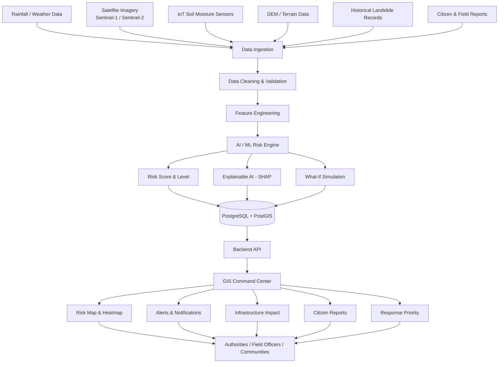
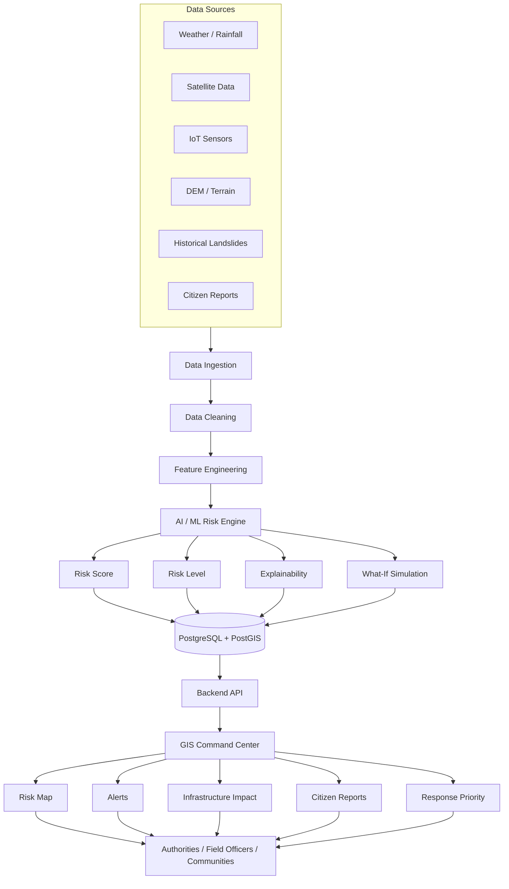

# 🛰️ Landslide Sentinel

### AI-Powered Early Warning & Risk Intelligence Platform for Northeast India

> Turning environmental data into actionable disaster intelligence.

```
DATA → AI → RISK → WARNING → ACTION
```

<div align="center">


**EARLY WARNING • GEOINTELLIGENCE • AI • GIS • RESILIENCE**

</div>

---

## 📋 Problem Statement

| Field | Value |
|---|---|
| **Problem Statement ID** | 26001 |
| **Title** | AI-Based Early Warning and Landslide Risk Monitoring System in NER |
| **Organization** | Ministry of Development of North Eastern Region (MDoNER) |
| **Category** | Software |
| **Theme** | Disaster Management |

---

## 🌏 The Problem

The North Eastern Region (NER) of India is one of the most landslide-prone regions in the country, shaped by steep terrain, high monsoon rainfall, seismic activity, and rapidly changing land use. Existing landslide monitoring approaches in the region are often:

- Fragmented across departments and data sources
- Reactive rather than predictive
- Dependent on manual field surveys with limited real-time visibility
- Lacking an integrated view that connects environmental data to on-ground impact (roads, villages, hospitals, schools)

Communities and disaster-management authorities need a system that turns scattered environmental signals into **clear, explainable, and actionable risk intelligence** — before a landslide happens, not just after.

---

## 💡 The Solution

**Landslide Sentinel** is an **AI-assisted landslide risk assessment and early-warning decision-support system**. It is not a system that predicts the exact time of a landslide — no system can responsibly claim that. Instead, it continuously analyzes environmental and geospatial data to estimate **relative landslide risk** for locations across the NER, explains *why* a location is flagged as high-risk, lets authorities simulate *what-if* scenarios, and connects that intelligence to real-world response — field verification, infrastructure impact, and community reporting.

```
DATA → PROCESSING → AI RISK ANALYSIS → PREDICTION → EARLY WARNING → ACTION → FIELD VERIFICATION → FEEDBACK
```

The system ingests rainfall/weather data, soil moisture, satellite imagery, terrain/elevation/slope data, historical landslide records, IoT sensor data, and citizen/field reports — and fuses them into a single operational picture on a GIS command center.

---

## 🔄 Live System Flow



---

## ⭐ Key Capabilities

| Capability | Description |
|---|---|
| 🧠 **AI Risk Prediction** | Estimates landslide risk probability per location using environmental and terrain features |
| 🔍 **Explainable Risk (XAI)** | Shows which factors most influenced each prediction, not a black-box score |
| 🧪 **What-If Simulator** | Lets authorities test hypothetical scenarios (e.g. "+40mm rainfall") using the same validated model |
| 🗺️ **GIS Command Center** | Interactive map with risk layers, infrastructure, alerts, and reports |
| 🚨 **Priority-Based Alerts** | Ranks response priority using Risk × Potential Impact, not risk alone |
| 🛰️ **Satellite Integration** | Sentinel-1 (radar) and Sentinel-2 (optical) derived indicators |
| 🌧️ **Weather Integration** | Real-time and cumulative rainfall tracking |
| 📡 **IoT Soil Moisture** | Targeted sensor deployment at critical zones |
| 📢 **Citizen Reporting** | Photo/video/GPS-based hazard reporting with field verification |
| 📴 **Offline-First** | PWA with local queueing for low-connectivity NER field conditions |
| 🌐 **Multilingual Alerts** | Designed to support multiple regional languages and channels |

---

## 🧠 AI Risk Prediction

The AI risk engine analyzes multiple environmental and geospatial indicators for a given location, including:

- Recent rainfall and rainfall intensity
- Cumulative rainfall (short-term and multi-day)
- Soil moisture levels
- Slope, elevation, and terrain characteristics
- Historical landslide activity in the vicinity
- Satellite-derived surface change indicators
- Other available environmental indicators

**Output for each location:**

- Risk probability (%)
- Risk level classification: `Low` / `Moderate` / `High` / `Critical`
- Location-specific, time-stamped risk assessment

> ⚠️ The risk probability is a **model estimate based on available data**, not a guarantee or a certainty of occurrence. It is designed to support — not replace — expert judgment and field verification.

---

## 🔍 Explainable Risk — "Why Is This Area High Risk?"

Every high-risk location on the dashboard comes with a transparency panel explaining the model's reasoning, generated using an explainability method such as **SHAP** (SHapley Additive exPlanations) or a comparable feature-attribution technique.

```
Risk Score: 87%
Risk Level: HIGH

Factors that most influenced the model's prediction:
  • Very high recent rainfall
  • High soil moisture
  • Steep slope
  • Previous landslide activity in this zone
  • Recent satellite-derived surface changes
```

> ℹ️ These are factors that **most influenced the model's prediction** — this is a statistical attribution, not a causal claim. The UI intentionally avoids language like *"these factors caused the landslide"* and instead uses language like *"factors that most influenced the model's prediction."*

---

## 🧪 What-If Landslide Simulator

The What-If Simulator lets an authority or analyst explore hypothetical environmental changes **using the same validated risk model** that powers live predictions — it is not a separate, unvalidated prediction pathway.

```
Current Conditions
─────────────────────
Rainfall:        120 mm / 24h
Soil Moisture:   76%
Slope:           38°
Current Risk:    64%

Scenario: Increase rainfall by 40 mm

Predicted Risk:  79%
Risk Change:     +15 percentage points
```

**Design safeguards:**

- Scenario inputs are expected to stay within ranges supported by the training/validation data.
- If a scenario falls outside the model's validated range, the UI displays:

  > ⚠️ *"Scenario outside validated model range. This result may be unreliable."*

- The simulator is a **decision-support tool**. It does **not** automatically trigger evacuation orders or any automated response action — all operational decisions remain with human authorities.

---

## 🗺️ GIS Command Center

The GIS dashboard is the operational heart of the platform — a single map that brings together risk intelligence, infrastructure context, and field activity.

**Map layers (proposed):**

`Landslide Risk Heatmap` · `High-Risk Zones` · `Rainfall` · `Soil Moisture` · `Slope` · `Elevation` · `Historical Landslides` · `Satellite Observations` · `Roads` · `Villages` · `Hospitals` · `Schools` · `Critical Infrastructure` · `Citizen Reports` · `Field Reports` · `Active Alerts`

**When a user clicks a high-risk location, a detail panel shows:**

- Risk score and risk level
- Rainfall, soil moisture, slope, elevation
- Historical landslide information for the zone
- Satellite-derived indicators
- Nearby roads, villages, and critical infrastructure
- Explanation of the model's prediction (Explainable AI)
- What-if simulation controls
- Recommended response priority

---

## 🚨 Emergency Response Prioritization

Landslide Sentinel does not rank locations by probability alone. It combines **Risk × Potential Impact** to produce an operational priority score.

```
Risk × Potential Impact = Response Priority
```

**Example:**

| Location | Risk | Nearby Assets | Effective Priority |
|---|---|---|---|
| Zone A | 70% | No significant population nearby | Lower |
| Zone B | 55% | Dense population, major highway, hospital, school | **Higher** |

This helps district authorities and field teams decide **where to send limited resources first**, rather than simply chasing the highest raw probability score.

---

## 🛰️ Satellite Data

### Sentinel-1 (Radar / SAR)

Radar imagery can operate through night, cloud cover, and poor optical visibility — conditions common during NER's monsoon season. It contributes indicators useful for detecting surface and ground deformation signals over time.

### Sentinel-2 (Optical / Multispectral)

Optical imagery contributes indicators related to land cover, vegetation health, exposed soil, and surface changes — useful environmental context when skies are clear.

> ⚠️ Satellite imagery does **not** directly say *"landslide = yes."* It is one input among many:
>
> ```
> Satellite → Extract features/indicators → Combine with environmental data → AI model → Risk estimation
> ```

---

## 🌧️ Weather & Rainfall Integration

The platform is designed to integrate with weather/rainfall APIs to track:

- Current rainfall
- Rainfall intensity
- 1-hour, 6-hour, and 24-hour rainfall
- 3-day and 7-day cumulative rainfall
- Forecast rainfall
- Weather alerts

**Why cumulative rainfall matters:** landslide risk is often driven less by a single storm and more by **prolonged rainfall gradually saturating the soil**, reducing slope stability over days.

---

## 💧 Soil Moisture

Two complementary data sources are used:

| Source | Strength |
|---|---|
| **Satellite-derived soil moisture** | Broad geographic coverage across the region |
| **IoT soil moisture sensors** | High-frequency, localized readings at selected critical zones |

The architecture is intentionally designed **not** to depend on thousands of physical sensors. The recommended approach is:

```
Satellite + Weather Data  →  Broad regional coverage
              +
IoT Sensors               →  Selected critical/high-risk zones
```

This keeps the system scalable and practical to deploy across the NER.

---

## ⛰️ Terrain Data

Derived from Digital Elevation Model (DEM) sources:

- Elevation
- **Slope** — one of the most significant physical factors in landslide susceptibility, since steeper slopes reduce soil and rock stability under saturation and gravitational stress
- Aspect
- Curvature
- Terrain roughness

---

## 📜 Historical Landslide Data

Historical records, such as those available through the **ISRO Bhuvan Landslide Atlas**, support:

- Model training
- Model validation
- Identification of historically vulnerable zones
- Feature engineering
- Baseline risk mapping

> Dataset size depends on the final data collection and preprocessing pipeline.

---

## 📣 Citizen + Field Reporting

### Citizen Reports

Community members can submit:

- Photo
- Video
- GPS location
- Timestamp
- Description
- Severity assessment
- Road blockage information

### Field Officer Reports

Field officers can submit on-ground verification reports directly tied to alerts and citizen submissions.

### Feedback Loop

```
Prediction → Alert → Field Verification → New Data → Model / Monitoring Improvement
```

---

## 🛡️ Report Authentication

To reduce fake or low-quality reports, submissions can be cross-checked using:

- GPS coordinates
- Timestamp
- Device metadata (where appropriate and privacy-compliant)
- Duplicate detection
- Basic image analysis
- User verification status
- Field officer verification
- AI-assisted image classification

> ⚠️ These mechanisms **reduce** the likelihood of fake reports; they cannot **guarantee** perfect detection. Field verification remains an important safeguard.

---

## 📴 Offline-First Design

Connectivity in many parts of the NER is unreliable, especially during severe weather — exactly when the system matters most. The platform is designed offline-first:

- Progressive Web App (PWA)
- IndexedDB / local storage for offline data
- Offline report creation
- Offline map/cache where practical
- Background synchronization
- Automatic upload when connectivity returns
- Offline status indicator
- Sync queue for pending submissions

**Example flow:**

```
Field officer captures a photo report with no internet connection
        ↓
Report is stored in the local queue on the device
        ↓
Connectivity is restored
        ↓
LOCAL QUEUE → SERVER → DATABASE → GIS DASHBOARD
```

---

## 🌐 Multilingual Alerts

Notifications are designed to reach people through multiple channels:

- Web dashboard
- Mobile / PWA push notifications
- SMS
- Local-language notifications

The notification architecture is built so additional languages can be added without structural changes. *(Specific languages are added as they are implemented — none are claimed here beyond the design capability.)*

---

## 🚦 Alert System

| Level | Meaning |
|---|---|
| 🟢 **LOW** | Baseline monitoring, no elevated concern |
| 🟡 **MODERATE** | Conditions warrant awareness |
| 🟠 **HIGH** | Conditions warrant close monitoring and possible field check |
| 🔴 **CRITICAL** | Conditions warrant immediate attention and response coordination |

**Each alert includes:**

- Location
- Risk level and probability
- Major influencing factors
- Timestamp
- Nearby affected assets
- Recommended action
- Map location

Authorities can configure alert thresholds. Alerts are designed to be combined with human verification and existing disaster-management operating procedures — not to act as an automated trigger.

---

## 🧰 Tech Stack

| Layer | Technology |
|---|---|
| Frontend | Next.js + React + TypeScript + Tailwind CSS |
| GIS | MapLibre GL JS + OpenStreetMap + PostGIS |
| Backend | Node.js + Express.js |
| AI/ML | Python + FastAPI + scikit-learn + XGBoost + SHAP + Pandas + NumPy |
| Database | PostgreSQL + PostGIS |
| Cache / Jobs | Redis + BullMQ |
| Offline | PWA + IndexedDB |
| Auth | JWT / secure session-based authentication |
| Deployment | Vercel (frontend) + Docker + Cloud VM/container (backend & AI services) |

> 🏷️ **Implemented vs. Planned:** Component status is tracked in the [Project Status](#-project-status) table below. Not every technology listed here is implemented yet — this table reflects the intended architecture.

---

## 📊 Quick Project Summary

| Layer | Technology |
|---|---|
| Frontend | Next.js + TypeScript |
| GIS | MapLibre + PostGIS |
| Backend | Node.js + Express |
| AI | Python + XGBoost |
| Explainability | SHAP |
| Database | PostgreSQL + PostGIS |
| Satellite | Sentinel-1 / Sentinel-2 |
| Weather | Weather / IMD APIs |
| Offline | PWA + IndexedDB |

---

## 🔌 API Integrations

| Source | Used For |
|---|---|
| **Copernicus Data Space / Sentinel Hub** | Sentinel-1, Sentinel-2 imagery, satellite metadata, image processing |
| **ISRO Bhuvan APIs** | Village geocoding, reverse geocoding, routing, and other available GIS services |
| **Weather / IMD** | Rainfall observations, forecasts, weather alerts |
| **DEM / Terrain Sources** | Elevation, slope, terrain analysis |
| **ISRO Bhuvan Landslide Atlas** | Historical landslide records for training/validation/reference |

> Endpoints and exact service capabilities depend on official documentation and access approvals; this list reflects intended data sources, not confirmed integrations. Refer to each provider's official documentation before implementation.

---

## 🏗️ System Architecture



---

## 🔁 Data Pipeline

```mermaid
flowchart LR
    A[Raw Data] --> B[Validation]
    B --> C[Cleaning]
    C --> D[Missing Data Handling]
    D --> E[Feature Engineering]
    E --> F[Model]
    F --> G[Risk Probability]
    G --> H[Risk Classification]
    H --> I[Explainability]
    I --> J[GIS Visualization]
    J --> K[Alert / Response]
```



---

## 🤖 Machine Learning Pipeline

**Features:**

- Rainfall (recent, cumulative)
- Soil moisture
- Slope
- Elevation
- Historical landslide activity
- Satellite-derived indicators

**Target variable:** `landslide_occurred`

```
0 = no landslide event
1 = landslide event
```

**Pipeline considerations:**

- Train / validation / test split
- Handling class imbalance (landslide events are rare relative to non-events)
- Feature engineering from raw environmental data
- Cross-validation
- Overfitting prevention
- Model evaluation on held-out data

**Evaluation metrics:**

`Precision` · `Recall` · `F1-score` · `ROC-AUC` · `PR-AUC` · `Confusion Matrix`

> For an early-warning system, **false negatives (missed high-risk events) can be especially serious**, so recall is emphasized as a key metric — while precision is also tracked to avoid alert fatigue from excessive false alarms.

> 📈 **Model performance will be reported after training and validation on the final dataset.** No accuracy figures are claimed at this stage.

---

## 🧮 Model Choice

**XGBoost** is a strong candidate for this problem because it:

- Performs well on structured/tabular environmental data
- Handles nonlinear relationships between features
- Works well with mixed feature types (rainfall, slope, categorical terrain features, etc.)
- Provides native feature importance
- Is compatible with SHAP-based explainability

> XGBoost is a strong candidate — **not automatically the final or "best" model.** Baseline models such as **Logistic Regression**, **Random Forest**, and **XGBoost** are intended to be compared during experimentation before finalizing the production model.

---

## 🔐 Security

- Authentication for all authority/officer roles
- Role-based access control (RBAC)
- Secure, validated API endpoints
- Input validation and sanitization
- Rate limiting
- HTTPS everywhere
- Secure handling of environment variables and secrets
- Password hashing (never plaintext)
- Minimal collection of personal data
- Controlled, role-gated access to precise location data
- Audit logs for authority actions

---

## 📈 Scalability

Designed to scale progressively:

```
One District  →  Multiple Districts  →  Entire Northeast Region
```

**Supporting design choices:**

- Cloud-based deployment
- API-first, service-oriented architecture
- Background job processing (Redis + BullMQ)
- Database indexing and PostGIS spatial indexing
- Modular satellite data processing pipelines
- Object storage for imagery and media
- Horizontal scaling of backend/AI services

---

## 👥 User Roles

| Role | Responsibilities |
|---|---|
| **Citizen** | Report landslides and hazards from the ground |
| **Field Officer** | Verify citizen reports and inspect flagged locations |
| **District Authority** | Monitor regional risk and manage alert response |
| **Disaster Management Team** | Coordinate emergency response across zones |
| **System Administrator** | Manage platform users, configuration, and access |
| **Analyst** | Analyze historical and environmental data, review model performance |

---

## 🗂️ Repository Structure

> The structure below reflects the proposed/target architecture. It will be updated to match the actual repository as implementation progresses.

```text
project-root/
│
├── frontend/
│   ├── app/
│   ├── components/
│   ├── features/
│   ├── hooks/
│   ├── lib/
│   ├── services/
│   └── public/
│
├── backend/
│   ├── src/
│   │   ├── controllers/
│   │   ├── routes/
│   │   ├── services/
│   │   ├── middleware/
│   │   └── utils/
│   └── package.json
│
├── ai-service/
│   ├── app/
│   ├── models/
│   ├── preprocessing/
│   ├── training/
│   ├── inference/
│   └── requirements.txt
│
├── data/
│   ├── raw/
│   ├── processed/
│   └── samples/
│
├── infrastructure/
│   ├── docker/
│   └── deployment/
│
├── docs/
│   └── screenshots/
│
├── docker-compose.yml
├── .env.example
└── README.md
```

---

## 🎬 Demo User Flow

An end-to-end walkthrough of the system in action:

1. **Heavy rainfall is detected** in a monitored NER district.
2. Rainfall crosses an elevated internal threshold.
3. **Soil moisture** readings begin increasing in the area.
4. Terrain data confirms the zone has **steep slopes**.
5. Historical records show **previous landslide activity** nearby.
6. Satellite data contributes additional **surface-change indicators**.
7. The **AI model calculates an elevated risk score** for the location.
8. The **GIS dashboard highlights** the location on the risk map.
9. **Explainable AI** shows the authority *why* the risk increased.
10. The **What-If Simulator** shows how risk could change under further rainfall.
11. Nearby **roads, villages, and infrastructure** are automatically identified.
12. A **response priority score** is calculated (Risk × Impact).
13. **Authorities receive an alert** with all relevant context.
14. A **field officer is dispatched** and verifies the location on the ground.
15. The verification report **feeds back into the system**, improving future monitoring.

---

## 🛠️ Local Development

### Requirements

- Node.js (LTS recommended)
- Python 3.x
- PostgreSQL with PostGIS extension
- Git
- Docker (optional, recommended for consistent environments)

### Installation

```bash
# Clone the repository
git clone <repository-url>
cd <repository-folder>
```

**Frontend setup:**

```bash
cd frontend
npm install
npm run dev
```

**Backend setup:**

```bash
cd backend
npm install
npm run dev
```

**AI service setup:**

```bash
cd ai-service
pip install -r requirements.txt
uvicorn app.main:app --reload
```

**Database setup:**

```bash
# Ensure PostgreSQL + PostGIS are installed and running
# Create the database and enable the PostGIS extension
createdb landslide_sentinel
psql -d landslide_sentinel -c "CREATE EXTENSION postgis;"
```

> ⚠️ Exact scripts, ports, and commands depend on the final repository setup. Replace placeholders above (`<repository-url>`, `<repository-folder>`) with actual values once finalized.

---

## ⚙️ Environment Variables

Create a `.env` file based on `.env.example`:

```env
DATABASE_URL=
COPERNICUS_CLIENT_ID=
COPERNICUS_CLIENT_SECRET=
WEATHER_API_KEY=
REDIS_URL=
JWT_SECRET=
```

> 🔒 **Never commit real API keys or secrets to version control.**

---

## 🔗 API Architecture

```text
Next.js Frontend
       ↓
Express Backend API
       ↓
PostgreSQL / PostGIS

Express Backend API
       ↓
FastAPI AI Service
       ↓
ML Model

Background Workers
       ↓
Weather / Satellite APIs
```

**Example / planned API design** *(not all endpoints are implemented yet)*:

```text
GET  /api/risk/:location
GET  /api/risk/map
POST /api/reports
GET  /api/reports
POST /api/simulation
GET  /api/alerts
```

---

## 🖥️ Platform Preview

> Screenshots will be added as the UI is finalized. Placeholders below indicate intended visuals.

<div align="center">

| Dashboard | Risk Map |
|---|---|
| `docs/screenshots/dashboard.png` | `docs/screenshots/risk-map.png` |

| Risk Analysis | What-If Simulator |
|---|---|
| `docs/screenshots/risk-analysis.png` | `docs/screenshots/what-if.png` |

| Mobile / Field View |
|---|
| `docs/screenshots/mobile.png` |

</div>

---

## ✅ Project Status

| Module | Status |
|---|---|
| Frontend | Planned |
| GIS Dashboard | Planned |
| AI Risk Model | Planned |
| Weather Integration | Planned |
| Satellite Integration | Planned |
| IoT Sensor Integration | Planned |
| Alert System | Planned |
| Offline Mode | Planned |

> Status values should be updated as modules move from `Planned` → `Prototype` → `Implemented`.

---

## 🗺️ Future Roadmap

- [ ] **Phase 1** — Historical dataset collection, baseline ML model, initial risk scoring
- [ ] **Phase 2** — GIS dashboard, PostGIS integration, terrain layers
- [ ] **Phase 3** — Weather integration, real-time updates
- [ ] **Phase 4** — Satellite integration (Sentinel-1 / Sentinel-2 processing)
- [ ] **Phase 5** — IoT sensor integration, offline PWA
- [ ] **Phase 6** — Explainable AI, What-If simulator
- [ ] **Phase 7** — Authority alerting, field verification workflow, regional scalability

---

## 🎯 Why This Is Different

Most existing tools stop at:

```
"Landslide Map"
```

**Landslide Sentinel** combines:

```
Monitoring
   +
Prediction
   +
Explainable AI
   +
What-If Simulation
   +
GIS Intelligence
   +
Impact Prioritization
   +
Citizen Reporting
   +
Offline Field Operations
   +
Early Warning
```

This is designed as an **end-to-end operational platform** — connecting environmental data, AI reasoning, field verification, and human decision-making — rather than a static visualization dashboard.

---

## 🌱 Impact

- Earlier awareness of elevated-risk conditions
- Better disaster preparedness planning
- Faster field verification cycles
- More informed resource and response prioritization
- Improved monitoring of road and infrastructure exposure
- Greater community participation through citizen reporting
- More data-driven decision-making for authorities
- Improved coordination between authorities and field teams

*(Impact statements reflect intended design goals; no specific numerical outcomes are claimed without evaluation.)*

---

## ⚠️ Limitations

Being transparent about constraints strengthens, not weakens, the system's credibility:

- Satellite revisit frequency limits how often surface indicators can be refreshed
- Optical imagery (Sentinel-2) is affected by cloud cover
- IoT sensors can fail or report intermittently
- Missing or incomplete data can affect model reliability
- All model outputs carry inherent uncertainty
- Historical landslide labels may be limited or incomplete in some areas
- The model can produce false positives and false negatives
- Poor connectivity in parts of the NER can delay data flow
- Field verification remains necessary — the system supports, but does not replace, expert judgment

---

## 📌 Important Accuracy Notes

This project intentionally avoids overstating its capabilities. Specifically, it does **not** claim to:

- Predict the exact time of a landslide
- Guarantee any stated accuracy figure
- Provide APIs, datasets, or sensor networks beyond what is verified/implemented
- Detect landslides directly from satellite imagery alone
- Automate evacuation decisions
- Represent unverified government partnerships

All capabilities are labeled as one of: **Implemented**, **Prototype**, **Planned**, or **Proposed Architecture**.

---

## 👥 Team / Contributors

> Team member details to be added by the project team.

| Name | Role |
|Prince|developer|


---

## 📄 License

> License to be determined.

---

<div align="center">

**Landslide Sentinel** — built for Smart India Hackathon 2026, Problem Statement 26001, on behalf of the Ministry of Development of North Eastern Region (MDoNER).

*Turning environmental data into actionable disaster intelligence.*

</div>
